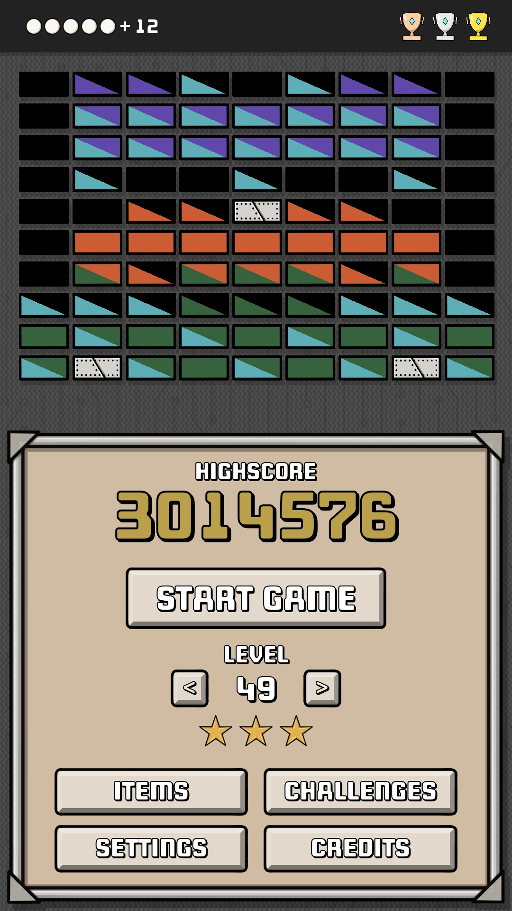
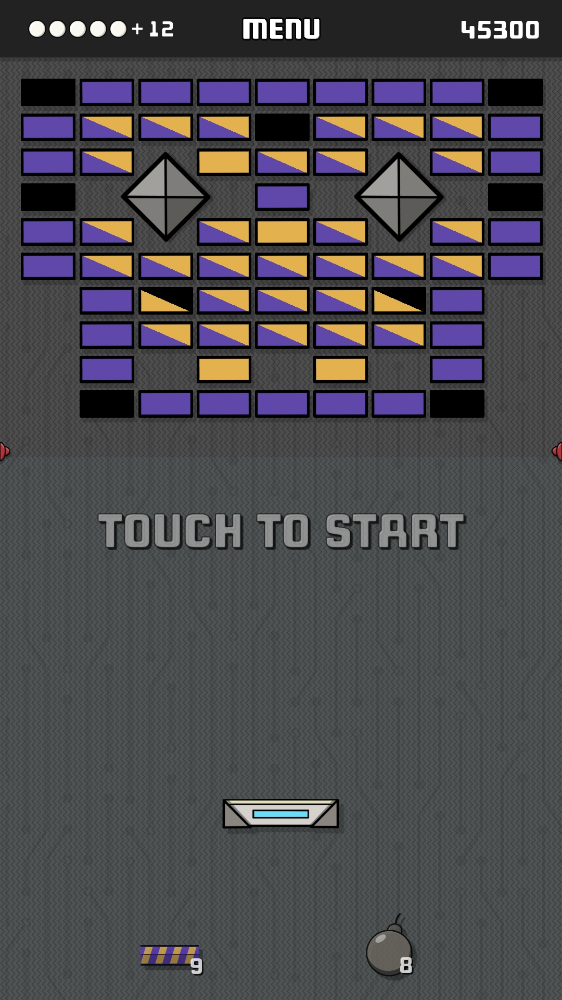
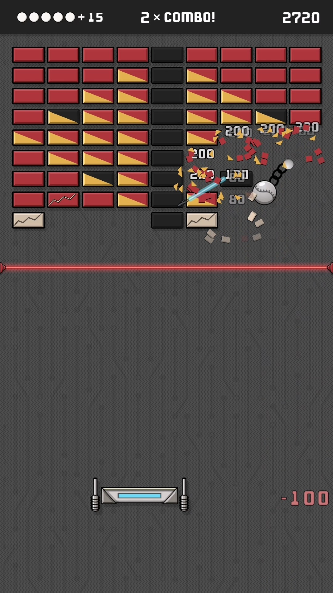
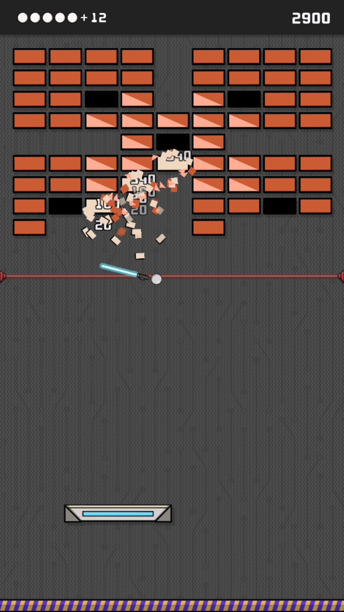
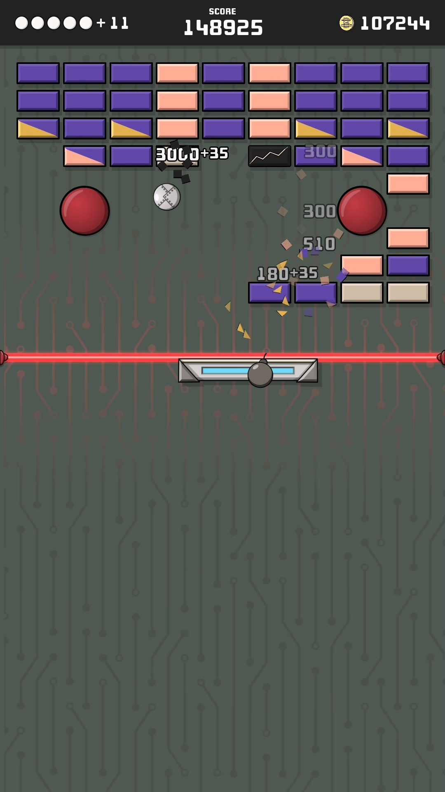
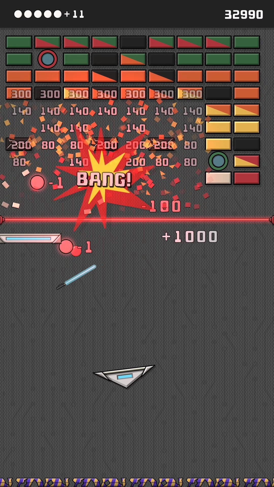
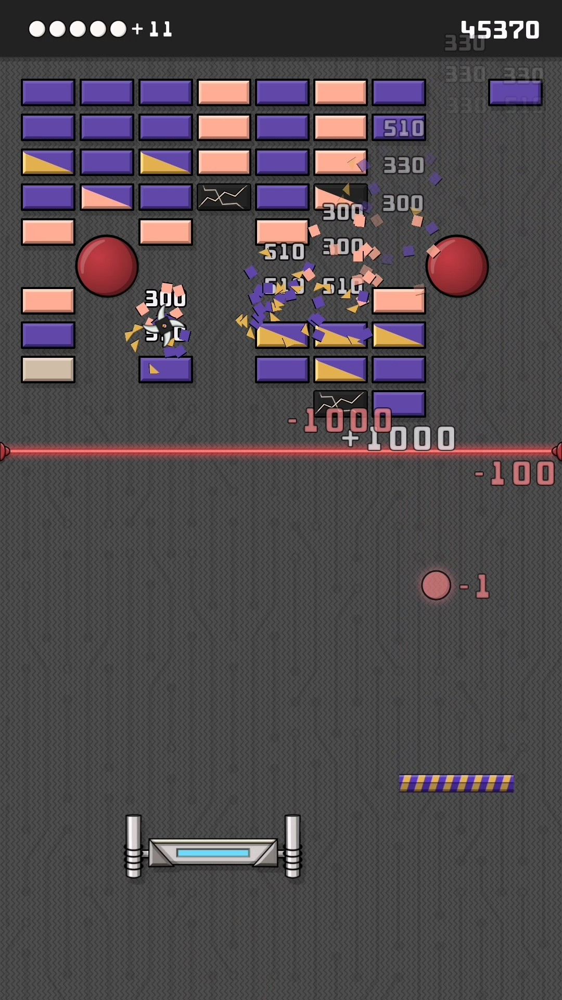
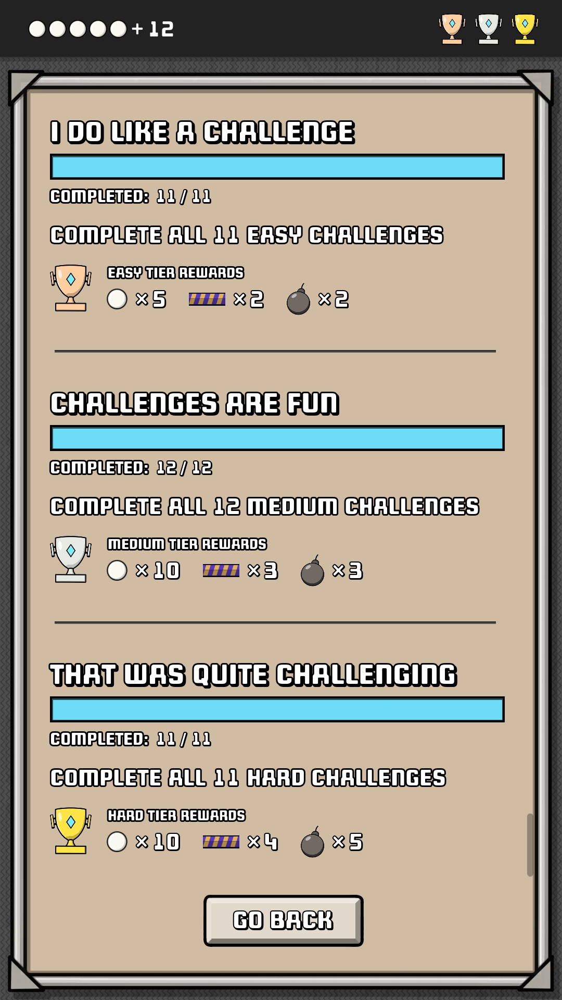

 

Brick Pong revolutionises the classic breakout genre with a **unique twist**: Experience unrestricted paddle movement in all directions, whilst the ball responds to **gravity, friction, torque, and paddle impact** driven by a powerful **2D physics engine**.

This is the **most dynamic brick breaker game** you've ever tried. Conquer the **50 increasingly challenging levels** and unlock a range of items that can aid or hinder your progress. Strategise and make split-second decisions to utilise power-ups effectively and overcome obstacles.

Complete **various challenges** to earn valuable items and extra balls, and **replay any level as many times as you like**, as each game promises a unique experience.

With its meticulously designed levels and **fast-paced, addictive gameplay**, Brick Pong seamlessly blends nostalgia with a modern twist on retro brick breaker mechanics.

**Get ready to break some bricks!**

## Have a loot at these screenshots

    
    
    
    
    
    
    
    

## Or see it in action

    <video width="320" height="180" controls style="margin:0 auto !important;">
      <source src="./Videos/BrickPong__PlayStore_Final.mp4" type="video/mp4">
    Your browser does not support the video tag.
    </video>

 

## Features

✅ Hours of highly addictive, fast-paced, dynamic gameplay

✅ 50 increasingly difficult levels (more to come)

✅ 16 unique items to unlock as you advance in the game (more to come)

✅ Retro-inspired hand-drawn graphics with a minimalist, distraction-free interface

✅ Engaging challenges with rewarding prizes

✅ Powered by a real 2D physics engine

✅ Adjustable ball speed for customisable gameplay

✅ Fully offline play, no accounts or logins required (internet connection only needed for advertisements)

✅ No disruptive ads

✅ Compact download size (~30MB)

## Data protection and privacy

to learn more abouit how we handle your data, read our [Privacy Policy](https://attila-o-games.github.io/Privacy_Policy.html). To learn more about how Leaderboard data is processed in complete anonymity, see [this page](https://attila-o-games.github.io/my_data/data-privacy.html)

Google Play and the Google Play logo are trademarks of Google LLC.

