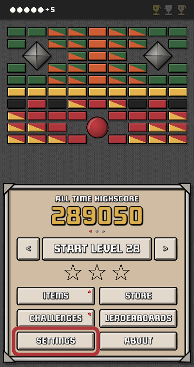
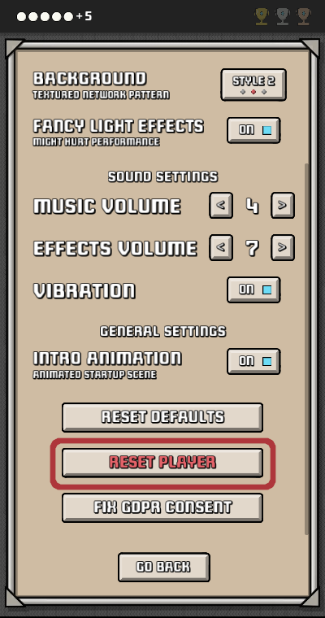
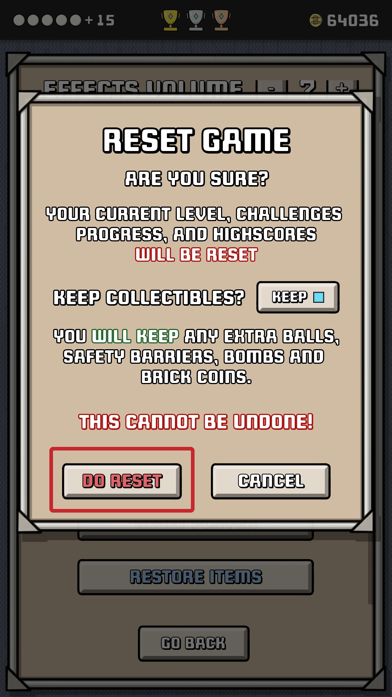

## About Leaderboards

### Your data is safe, and anonymous

Since version 1.3 Brick Pong has started offering a new "*Global Leaderboards*" function. As you might have noticed, **participation in the Leaderboards is automatic, you do not need to register a user, give us your email, or create a password.**

#### So how does this even work?

When you first start Brick Pong with a working internet connection (or upgrade from an older version), Brick Pong will create a user on its Leaderboards back-end, provided by [SilentWolf](https://silentwolf.com). For this, a *unique identifier string* is created for your device, which is then cryptographically altered, until it is not only unrecognisable but cannot, in any way, be linked to your phone, your person, or anything you do, other than your game highscore.

This cryptographic identifier is then sent to the server, along with your chosen display name and your latest scores, and that's it. **No other data is ever stored, and even the stored data makes no sense outside of the game context.** In other words, **the data is completely anonymous, does not contain any identifiable information, or any meaningful information, other than a few game scores**.

This is approximately **as private and secure as the game developer can currently imagine**, but if it can be made even more so (while preserving functionality), it will be done in the future.

### Deleting your data

You can ***completely remove all stored data***, by simply **resetting the game**. To do this, Press *Settings* from the main menu...

   
  
   

 

...scroll down, until you see the button labelled *Reset Player*...

   
  
   

 

...and choose "Do Reset"...

   
  
   

 

...and you are done.

Besides resetting your current progress, this action will remove all data stored in the Leaderboards backend server. Since there is no user account associated with you or your device, removing the currently stored scores means removing all your data. No new scores will be stored, until you set a new highscore.

### What if I already uninstalled the game?

If you have deleted Brick Pong, and want to get rid of your stored data, **you only need to reinstall the game on the same device and open it once with an active internet connection**. Since your scores will be now zero, all corresponding stored scores will be reset (in practice, they are deleted from the server).This is possibly, since the cryptographic identifier for your device will be the same as last time (since it is created the same way).

Since **there is no way to identify you or your device, the developer cannot offer to manually remove your score** (I would not know what to delete, or which score was yours).

*[Back to main page](https://attila-o-games.github.io/)*
